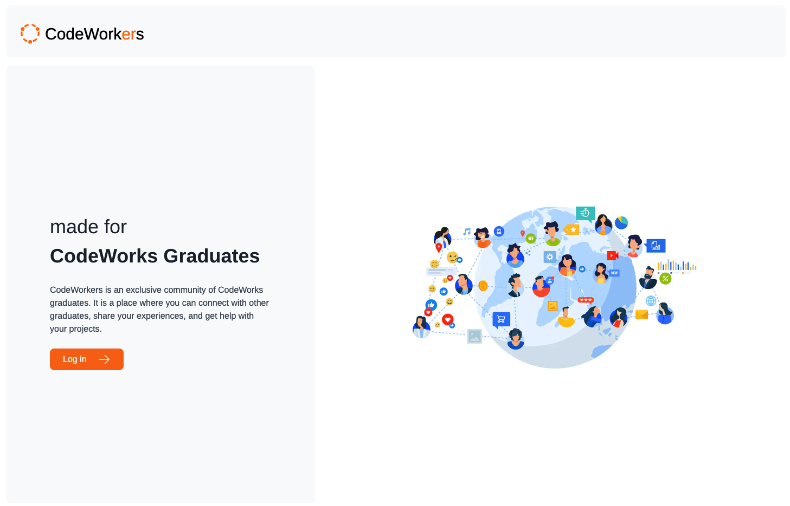
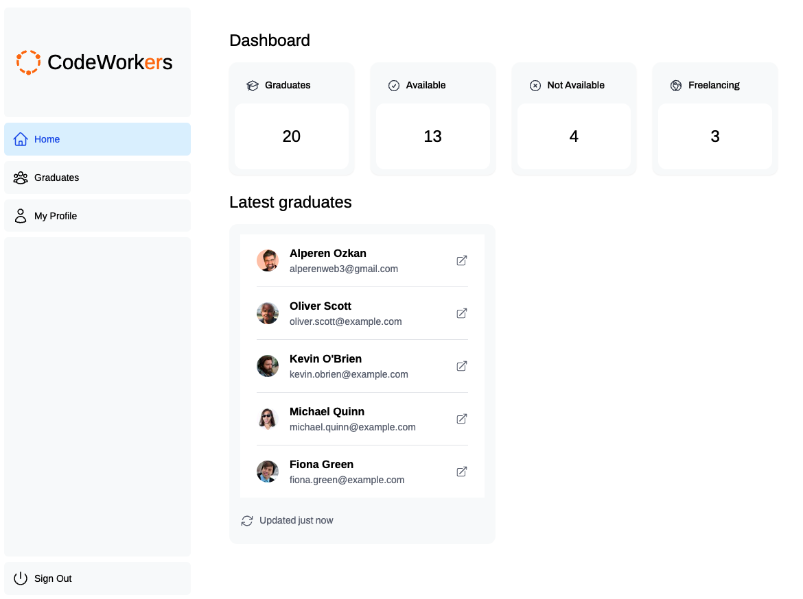
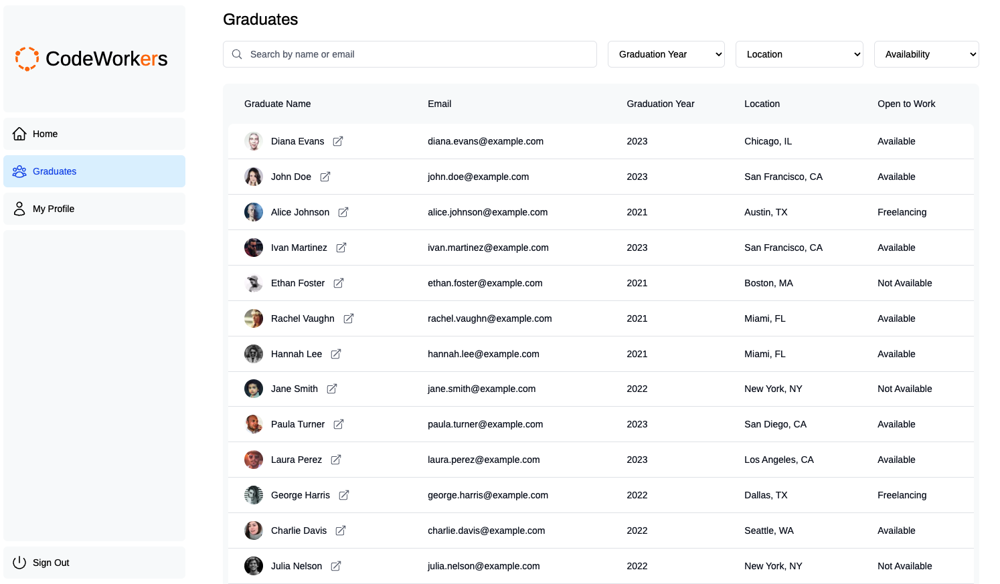
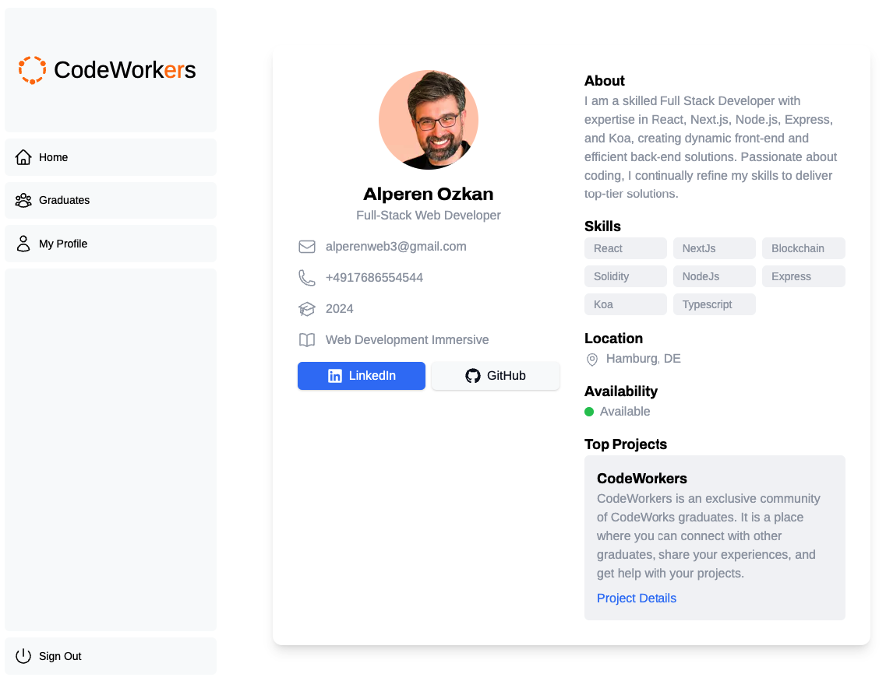

# CodeWorkers

<p align="center">
  
</p>


CodeWorkers is a dedicated platform for CodeWorks graduates. It offers opportunities to find your next job, connect with fellow graduates, collaborate on projects, and share your experiences.

1. It helps you to reach out to other graduates in your area or field of interest.
2. It gives you the opportunity to collaborate on projects with other graduates.
3. it is a best place for networking with other CodeWorks graduates.

## Screenshots

<p align="center">
  
  
  
</p>

## Getting started

Except for the regular suspects; git, Node, npm, you need these things to work on the CodeWorkers app. Follow the instructions supplied below them or on their links to get them up and running before you continue with *Installation*.

* Sign Up for a [Google Firebase](https://firebase.google.com/) account and create a new project. You will need to set up a Firestore database and enable Google Authentication.
* You can use mock data for the Firestore database. You can find the mock data in the `app/lib/firebase` folder.
* Use `addMockData.ts` to add the mock data to your Firestore database.
* Dont forget to creare a `.env.local` file in the root of the project and add the following environment variables:
  * `NEXT_PUBLIC_FIREBASE_API_KEY`
  * `NEXT_PUBLIC_FIREBASE_AUTH_DOMAIN`
  * `NEXT_PUBLIC_FIREBASE_PROJECT_ID`
  * `NEXT_PUBLIC_FIREBASE_STORAGE_BUCKET`
  * `NEXT_PUBLIC_FIREBASE_MESSAGING_SENDER_ID`
  * `NEXT_PUBLIC_FIREBASE_APP_ID`
  * `NEXT_PUBLIC_FIREBASE_MEASUREMENT_ID`

## Installation

This is a [Next.js](https://nextjs.org/) project bootstrapped with [`create-next-app`](https://github.com/vercel/next.js/tree/canary/packages/create-next-app).

1. Clone this repo and enter!

   ```bash
   git clone https://github.com/alperenweb3/codeworkers.git
   cd codeworkers
   ```

2. Install dependencies.

   ```bash
   npm install
   ```

3. Run the development server:

    ```bash
    npm run dev
    ```

4. Open [http://localhost:3000](http://localhost:3000) with your browser to see the result.

## Tech Stack

* [NextJs](https://nextjs.org/)
* [Typescript](https://www.typescriptlang.org/)
* [Firebase](https://firebase.google.com/)
* [Tailwind CSS](https://tailwindcss.com/)

## Learn More

To learn more about Next.js, take a look at the following resources:

- [Next.js Documentation](https://nextjs.org/docs) - learn about Next.js features and API.
- [Learn Next.js](https://nextjs.org/learn) - an interactive Next.js tutorial.

You can check out [the Next.js GitHub repository](https://github.com/vercel/next.js/) - your feedback and contributions are welcome!

## Deploy on Vercel

The easiest way to deploy your Next.js app is to use the [Vercel Platform](https://vercel.com/new?utm_medium=default-template&filter=next.js&utm_source=create-next-app&utm_campaign=create-next-app-readme) from the creators of Next.js.

Check out our [Next.js deployment documentation](https://nextjs.org/docs/deployment) for more details.

## Contributing

Improvements are welcome :)

Fork the repo and do your thing. Push to your fork and submit a pull request.

## Developer

* Alperen Ozkan - [GitHub](https://github.com/alperenweb3) - [LinkedIn](https://www.linkedin.com/in/alperenozkan/)

## License

This project is licensed under the MIT License.